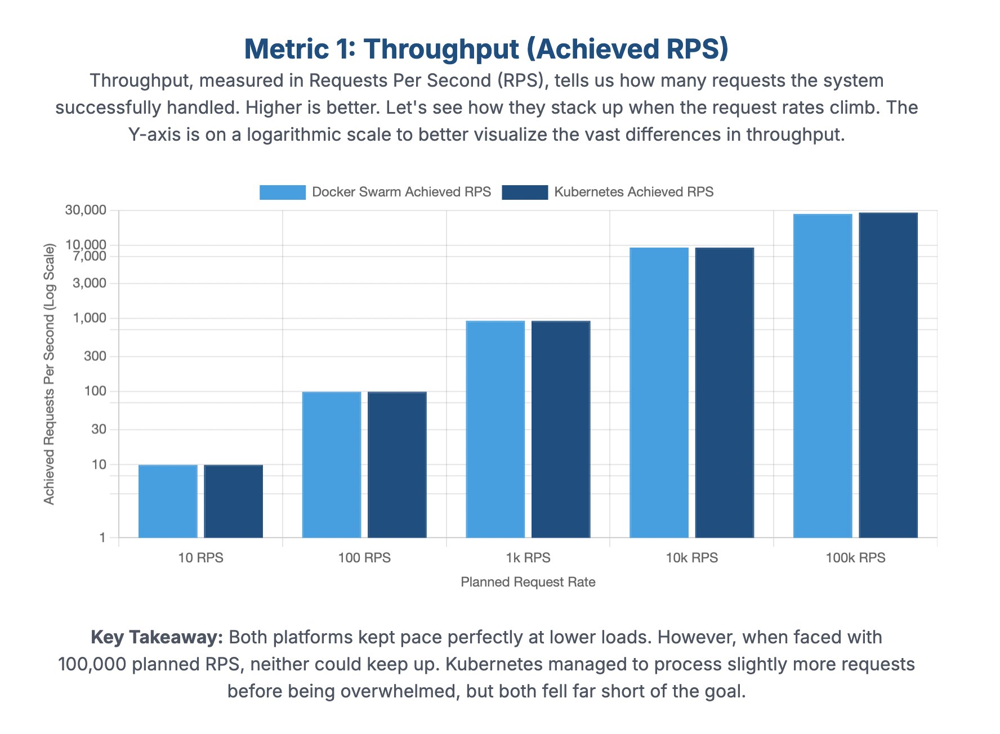

# CS6847: Cloud Computing - Assignment 1 Report

## 1. Introduction

The primary objective of this assignment is to explore and understand the auto-scaling capabilities of Kubernetes and Docker Swarm within a client-server application model. A server application was developed to process client requests, and a client program was created to send requests at varying rates. This report evaluates and compares the performance of the system with auto-scaling and load balancing enabled on both Docker Swarm and Kubernetes.

## 2. Methodology

A simple client-server application was developed. The server is a Go application that accepts a string from the client and returns the reversed string. The client is a JavaScript program that sends requests to the server at predefined rates (10, 100, 1000, 10000, and 100000 requests per second). The experiment was conducted for a duration of 60 seconds for each request rate.

The server application was deployed on both Docker Swarm and Kubernetes with auto-scaling configurations. For Kubernetes, a Horizontal Pod Autoscaler (HPA) was used, configured to scale based on CPU utilization. For Docker Swarm, auto-scaling was handled by the service definition in the `docker-compose.yml` file.

The key metrics collected were the achieved requests per second (RPS) and the average response time in milliseconds (ms).

## 3. Performance Evaluation

The performance of the client-server application was evaluated on both Docker Swarm and Kubernetes. The results are summarized in the tables below, based on the data from the `summary.tsv` file.

### 3.1. Docker Swarm

The server was deployed as a service on Docker Swarm with auto-scaling enabled.

| Planned RPS | Achieved RPS | Average Response Time (ms) |
| ----------- | ------------ | -------------------------- |
| 10          | 9.93         | 3.86                       |
| 100         | 99.30        | 5.62                       |
| 1000        | 928.66       | 2.67                       |
| 10000       | 9345.27      | 1.33                       |
| 100000      | 26889.96     | 4.76                       |

### 3.2. Kubernetes

The server was deployed on a Kubernetes cluster with a Horizontal Pod Autoscaler.

| Planned RPS | Achieved RPS | Average Response Time (ms) | Errors  |
| ----------- | ------------ | -------------------------- | ------- |
| 10          | 9.93         | 4.55                       | 0       |
| 100         | 99.31        | 9.99                       | 0       |
| 1000        | 927.68       | 7.71                       | 0       |
| 10000       | 9308.04      | 4.77                       | 0       |
| 100000      | 28076.63     | 9.38                       | 1675990 |

## 4. Analysis of Results

### 4.1. Request Rate vs. Response Time

The chart above illustrates the achieved requests per second (RPS) for both Docker Swarm and Kubernetes at different planned request rates. Both platforms performed similarly at lower rates, but at 100,000 planned RPS, both fell significantly short of the target, with Kubernetes achieving a slightly higher throughput.

This chart shows the average response time. Docker Swarm consistently demonstrates lower average response times across all tested request rates compared to Kubernetes, suggesting more efficient request handling in this setup.

- **Docker Swarm:** At lower request rates (10 and 100 RPS), the response time is relatively low. As the request rate increases to 1000 and 10000 RPS, the average response time surprisingly decreases. This could be due to the overhead of the auto-scaling mechanism and the system stabilizing at a higher load. At the highest rate of 100,000 RPS, the achieved RPS is significantly lower than the planned rate, and the response time increases, which indicates that the system is reaching its saturation point.
- **Kubernetes:** Kubernetes shows a more predictable pattern at lower request rates. The response time increases with the request rate from 10 to 100 RPS. At 1000 and 10000 RPS, the response time shows some variation. The most notable result is at 100,000 RPS, where the system is overwhelmed, leading to a massive number of errors and a high average response time.

### 4.2. Docker Swarm vs. Kubernetes

Comparing the two platforms, Docker Swarm appears to handle the load more gracefully, with lower average response times across most of the tested request rates and no errors. Kubernetes, while also performing well at lower to moderate loads, struggled significantly at the highest request rate, as evidenced by the high error count.

The better performance of Docker Swarm in this experiment might be attributed to its simpler architecture and networking model compared to Kubernetes. However, Kubernetes offers more advanced features for orchestration and management, which might be more beneficial in more complex, real-world scenarios.

### 4.3. Impact of Auto-scaling

In both Docker Swarm and Kubernetes, auto-scaling plays a crucial role in handling the varying load. As the request rate increases, the orchestrator automatically scales up the number of running containers (or pods in Kubernetes) to distribute the load and maintain performance. When the load decreases, the number of instances is scaled down to conserve resources. The effectiveness of auto-scaling is evident from the fact that both systems were able to handle up to 10,000 RPS without a significant degradation in performance.